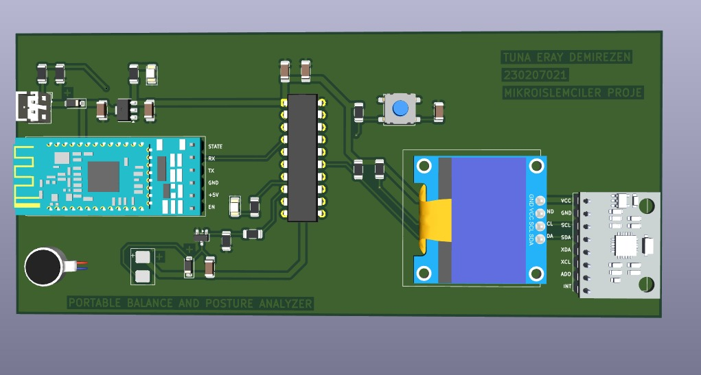
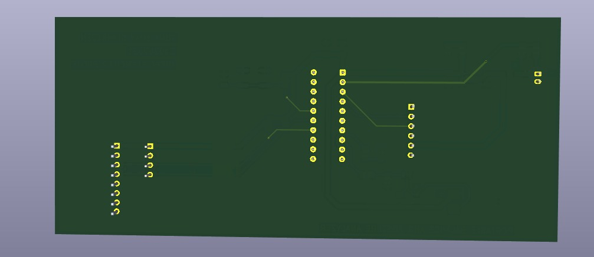

# Portable Posture & Balance Analyzer

A wearable device designed to monitor back and shoulder posture in real time, alerting the user via vibration and OLED display when poor posture is detected.

> **Work in Progress**  
> PCB design is complete. Firmware development is ongoing.

## Overview

This project is a health and ergonomics-focused embedded system that tracks posture using an IMU sensor. When poor posture is detected, the device triggers a vibration motor and displays a warning on the OLED screen. The system is built around the MSP430G2553 microcontroller.

## Components

- **MPU6050** - 6-axis IMU sensor (accelerometer + gyroscope)
- **Vibration Motor** - Haptic alert for poor posture
- **OLED Display** - Real-time posture score and warning display
- **HC-05 Bluetooth** - Daily report transmission
- **MSP430G2553** - Main microcontroller

## How It Works

1. MPU6050 raw accelerometer and gyroscope data is read over I2C.
2. Angle calculation is performed using `atan2`.
3. A posture score is computed periodically using Timer_A.
4. If poor posture is detected, the vibration motor is activated.
5. The OLED display shows posture status and warning messages.
6. A daily posture report is sent via Bluetooth to a paired device.

## Project Status

- [x] PCB design complete
- [ ] Firmware development in progress
- [ ] Testing and calibration
- [ ] Enclosure design

## Images

### PCB Front

### PCB Back

